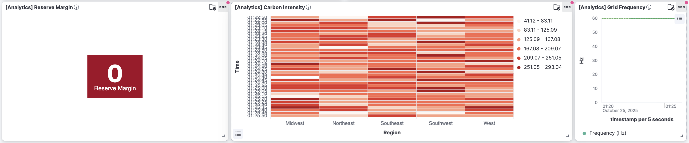

# Real-Time Grid Monitoring System

[](https://github.com/shivam1423/Real-Time-Grid-Monitoring-System)
[](https://opensource.org/licenses/MIT)

Real-time energy grid monitoring system with streaming data processing, anomaly detection, and carbon intensity tracking.

## Overview

Energy Grid Pulse is a comprehensive streaming data pipeline that monitors energy grids in real-time, tracking power demand, generation mix, grid stability, and carbon emissions. The system processes data through a modern tech stack including Kafka, Spark, Elasticsearch, and Kibana to provide actionable insights for grid operators.

### Key Features

- **Real-time Monitoring**: Track grid metrics with <5 second latency
- **Anomaly Detection**: Automatic detection of frequency deviations, voltage instabilities, and overload conditions
- **Carbon Tracking**: Real-time carbon intensity calculations based on generation mix
- **Generation Mix Analysis**: Track renewable vs fossil fuel generation in real-time
- **Multi-Region Support**: Monitor 5 regions simultaneously (Northeast, Southeast, Midwest, Southwest, West)
- **Scalable Architecture**: Built on Apache Kafka and Spark for high-throughput streaming
- **Rich Visualizations**: 8 interactive Kibana dashboards for grid health monitoring

## Architecture


### Technology Stack

- **Apache Kafka** - Message streaming and buffering
- **Apache Spark/PySpark** - Stream processing and analytics
- **Elasticsearch** - Search and analytics engine
- **Kibana** - Data visualization
- **MinIO** - Object storage (S3-compatible)
- **Apache Airflow** - Workflow orchestration
- **HDFS** - Distributed file storage
- **Docker** - Containerization

## Data Schema

```python
{
    'timestamp': timestamp,              # ISO 8601 format
    'region': str,                       # Grid region
    'grid_id': str,                      # Unique grid identifier
    'demand_mw': float,                  # Current demand in MW
    'total_generation_mw': float,        # Total generation capacity
    'generation_mix_percent': {          # Generation breakdown (%)
        'Solar': float,
        'Wind': float,
        'Natural_Gas': float,
        'Coal': float,
        'Nuclear': float,
        'Hydro': float
    },
    'generation_mw': { ... },            # Actual MW output per source
    'grid_frequency_hz': float,          # Should be ~60 Hz
    'voltage_kv': float,                 # Transmission voltage
    'carbon_intensity_gco2_kwh': float,  # Grams CO2 per kWh
    'reserve_margin_percent': float,     # Available capacity margin
    'is_anomaly': boolean,               # Anomaly flag
    'alert_level': str,                  # NORMAL/WARNING/CRITICAL
    'temperature_celsius': float,        # Ambient temperature
    'hour_of_day': int,                  # 0-23
    'renewable_percentage': float,       # % renewable generation
    'generation_cost_per_hour': float    # Cost in dollars
}
```

## Quick Start

### Prerequisites

- Docker and Docker Compose
- Python 3.10 or higher
- 8GB RAM minimum
- 20GB disk space

### Installation

1. Clone the repository
```bash
git clone https://github.com/shivam1423/Real-Time-Grid-Monitoring-System.git
cd Real-Time-Grid-Monitoring-System
```

2. Run the complete pipeline
```bash
chmod +x run_complete_pipeline.sh
./run_complete_pipeline.sh
```

This script will:
- Start all Docker services (Kafka, Spark, Elasticsearch, Kibana, MinIO, HDFS, Airflow)
- Create Kafka topics
- Start the data generator
- Launch Spark processing jobs
- Import the dashboard to Kibana

3. Access the dashboard
- Dashboard: http://localhost:5601/app/dashboards#/view/energy-grid-pro-dashboard
- Kibana: http://localhost:5601
- Airflow: http://localhost:8082
- Spark UI: http://localhost:8080
- MinIO: http://localhost:9001

4. Stop the pipeline
```bash
./stop_complete_pipeline.sh
```

## Configuration

Edit `config/energy_grid_config.yaml` to customize:

- Regions and base capacities
- Generation source mix
- Anomaly detection thresholds
- Carbon coefficients
- Streaming parameters

## Anomaly Detection

The system detects grid anomalies based on:

1. **Frequency Deviation**: >±0.015 Hz from 60.0 Hz
2. **Low Reserve Margin**: <5% available capacity
3. **Voltage Instability**: Outside 335-355 kV range
4. **Demand Spikes**: >150% of hourly average

Alert levels:
- **NORMAL**: All metrics within acceptable ranges
- **WARNING**: Minor deviations detected
- **CRITICAL**: Major stability issues requiring immediate action

## Carbon Intensity Calculation

Carbon intensity (gCO2/kWh) is calculated using weighted averages:

| Source | Coefficient (g/kWh) |
|--------|---------------------|
| Coal | 920 |
| Natural Gas | 450 |
| Solar | 50 |
| Wind | 10 |
| Nuclear | 10 |
| Hydro | 20 |

Formula: `carbon_intensity = Σ(generation_percent[source] × coefficient[source]) / 100`

## Dashboard

The system includes a professional Kibana dashboard with comprehensive visualizations:

- Real-time grid monitoring with color-coded KPIs
- Generation mix visualization (solar, wind, nuclear, etc.)
- Regional demand comparison
- Carbon intensity tracking
- Anomaly detection and alerts
- Grid frequency and voltage monitoring
- Renewable energy percentage tracking

The dashboard is automatically imported when running the complete pipeline script.




## Project Structure

```
energy_grid_pulse/
├── data_generator/
│   └── energy_grid_generator.py       # Realistic data generation
├── spark_scripts/
│   ├── process_energy_grid.py         # Core processing logic
│   ├── spark_to_elasticsearch.py      # Elasticsearch writer
│   └── spark_to_minio.py              # MinIO object storage writer
├── airflow_dags/
│   └── energy_grid_pipeline.py        # Airflow orchestration DAG
├── kafka_admin_client/
│   └── create_topics.py               # Kafka topic setup
├── config/
│   ├── energy_grid_config.yaml        # Main configuration
│   ├── elasticsearch_mappings.json    # Elasticsearch index mappings
│   └── environment_config.py          # Environment configuration
├── kibana_dashboards/
│   └── energy_grid_pro_final.ndjson   # Production dashboard
├── docker-compose.yml                 # Container orchestration
├── requirements.txt                   # Python dependencies
├── run_complete_pipeline.sh           # Start the complete pipeline
├── stop_complete_pipeline.sh          # Stop the pipeline
└── README.md                          # This file
```

## Performance

- **Throughput**: Processes 50+ events/second per region (250+ total/sec)
- **Latency**: <5 second end-to-end latency from generation to visualization
- **Storage**: ~100MB/hour of raw data (compressed)
- **Retention**: 7 days in Kafka, 30 days in Elasticsearch, unlimited in MinIO

## Monitoring

Check system health:

1. **Kafka**: `python kafka_admin_client/create_topics.py list`
2. **Elasticsearch**: `curl http://localhost:9200/_cluster/health`
3. **Spark**: Visit http://localhost:8080
4. **Airflow**: Visit http://localhost:8082

## Troubleshooting

**Issue**: Kafka not receiving data
```bash
# Check if Kafka is running
docker ps | grep kafka

# Check topic exists
python kafka_admin_client/create_topics.py list

# Verify data generator is running
ps aux | grep energy_grid_generator
```

**Issue**: Elasticsearch connection failed
```bash
# Check ES health
curl http://localhost:9200/_cluster/health

# Verify index exists
curl http://localhost:9200/_cat/indices
```

**Issue**: No data in Kibana
```bash
# Refresh index pattern in Kibana
# Management → Stack Management → Index Patterns → Refresh

# Check if data is flowing
curl http://localhost:9200/energy_grid_metrics/_search
```


## License

MIT License - see LICENSE file for details
---


